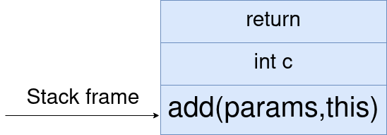
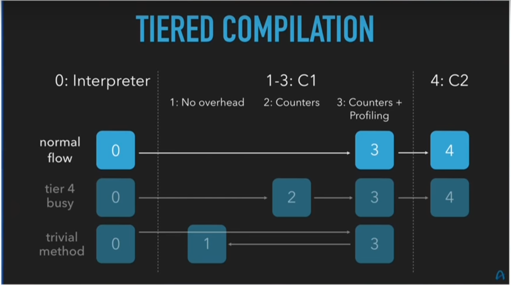
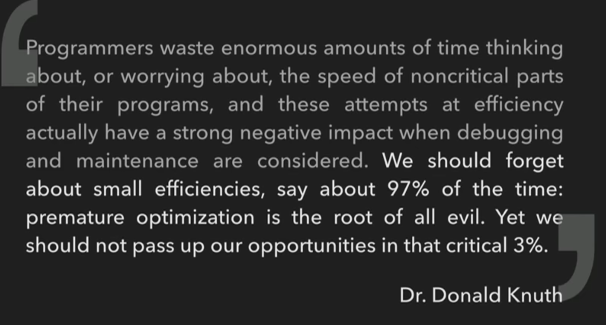
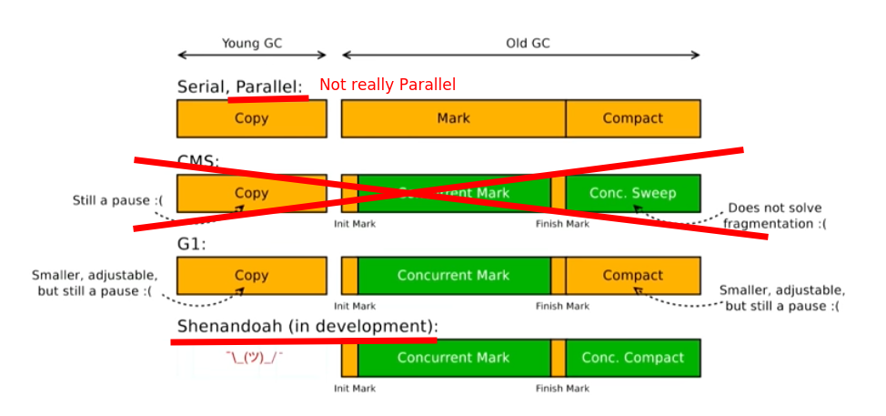
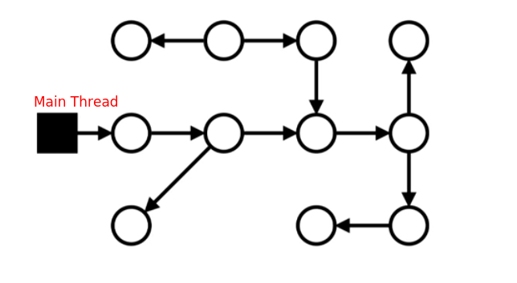
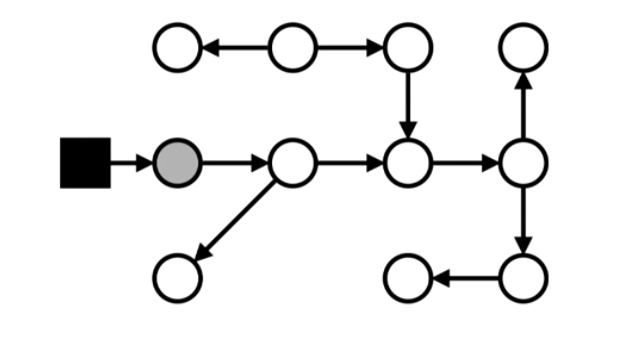
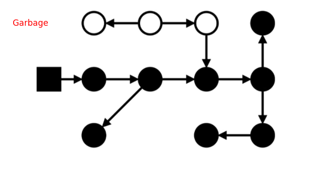
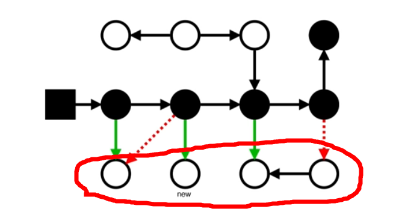

# Java 101

---
layout: center
class: 'text-white'
---

## whoami ? 
<style type="text/css">
    img {
        width: 250px;
    }
</style>


1. Java/Linux/DB/whatever business needs dev
2. Open source enthusiast
3. <logos-Blogger/> **Blog** - https://strogiyotec.github.io/
4. <logos-git/> **Github** - https://github.com/strogiyotec
4. <logos-telegram/> **Telegram** - @Lollipopster

---
layout: center
class: 'text-white'
---
# What will be covered ? 
1. What is Java ?
2. What is JVM ? 
3. You said Gc ?
4. Threading model
5. JIT compilation
6. Future of Java
   
---
layout: center
class: 'text-white'
---
# What won't be covered
1. Syntax (cmon just google it)
2. Spring(it's complicated)
3. How to become Java developer?


---
layout: center
class: 'text-white'
---


---
layout: center
class: 'text-white'
---
# Why ? 
1. It's interpreted
2. It's a GC language
3. Because NodeJs is faster
4. Because other people say so


---
layout: center
class: 'text-white'
---
# Compiled vs Interpreted


---
layout: center
class: 'text-white'
---
# Depends

##  Compiled language is a programming language whose implementations are typically compilers (translators that generate machine code from source code)

---
layout: center
class: 'text-white'
---
# Meet **javac**

#### .java -> .class

---


```java
public class Main {

    public static void main(String[] args) {
        int a = 5;
        int b = 10;
        int c = a + b;
        System.out.println(c);
    }
}

```
--- 

1. `javac Main.java` - compile it
2. `javap -v Main ` - show me the bytecode
```java {7,9,12,13}
  public static void main(java.lang.String[]);
    descriptor: ([Ljava/lang/String;)V
    flags: (0x0009) ACC_PUBLIC, ACC_STATIC
    Code:
      stack=2, locals=4, args_size=1
         0: iconst_5
         1: istore_1
         2: bipush        10
         4: istore_2
         5: iload_1
         6: iload_2
         7: iadd
         8: istore_3

```

<a href="https://docs.oracle.com/javase/specs/jvms/se7/html/jvms-6.html">Checkout other bytecode instructions</a>

---
layout: center
class: 'text-white'
---
# What is a bytecode?

1. Ease interpretation
2. Reduce OS dependence

---
layout: center
class: 'text-white'
---
# What about python ? 


```python
print("Let's print Full name")
full_name = first_name+" "+"Abdrazak"
print(full_name)
```
## Output
```python
Let's print Full name
Traceback (most recent call last):
  File "test.py", line 2, in <module>
    full_name = first_name+" "+"Abdrazak"
NameError: name 'first_name' is not defined
```

---
layout: center
class: 'text-white'
---
# Let's write an interpeter

---
layout: center
class: 'text-white'
---

```java
public class Interpreter {

    public static void main(String[] args) {
        var bytecode = "2*3";
        var numbers = new Stack<Integer>();
        var operands = new Stack<Character>();
        for (int i = 0; i < bytecode.length(); i++) {
            char c = bytecode.charAt(i);
            if (Character.isDigit(c)) {
                if (numbers.isEmpty()) {
                    numbers.push(Character.getNumericValue(c));
                } else {
                    numbers.push(Character.getNumericValue(c));
                    char operand = operands.pop();
                    switch (operand) {
                        case '+':
                            System.out.println(numbers.pop() + numbers.pop());
                            break;
                        case '*':
                            System.out.println(numbers.pop() * numbers.pop());
                            break;
                    }
                }
            } else {
                operands.push(c);
            }
        }

    }
}
```

---
layout: center
class: 'text-white'
---

# JVM - Java virtual Machine
1. Memory Management
2. Interpreter
3. Gc
4. JIT

---
layout: center
class: 'text-white'
---

# Memory Management
1. Stack
2. Heap

---
layout: center
class: 'text-white'
---

## Stack

1. Unique per thread
2. Has a limited size(8 Mb for AdoptOpenJDK, checkout doc for your distribution)
3. Store local primitives and references
4. StackOverFlowException

---
layout: center
class: 'text-white'
---

```java 
 void add(int first,int second){
        int c = first+second;
        return c;
}
```


#### Total size - around 16 bytes(`ref to **this** 4 bytes,3 ints *4`)
#### (Not really -_-)

---
layout: center
class: 'text-white'
---

# Heap

1. Stores all objects
2. Same for all threads
3. Subject for Garbage Collection
4. OutOfMemoryException
5. By default `java -XX:+UnlockDiagnosticVMOptions -XX:+PrintFlagsFinal -version`

---
layout: center
class: 'text-white'
---

# Question - how much memory ? 
```java

class Integer extends Number{
    int number;//int takes 4 bytes
}

Integer number = new Integer(42);
```
1. 4 byte
2. 8 byte
3. 16 byte

---
layout: center
class: 'text-white'
---


---
layout: center
class: 'text-white'
---

# Question 2

```java

class User {
    boolean enabled;//boolean takes 1 byte
}

User user = new User(false);
```

Metadata(8 byte) + Ref to class(4 byte) + enabled(1 byte) = 13 bytes ? 

---
layout: center
class: 'text-white'
---
# Right Answer is 16 bytes
## All objects are alligned by 8 bytes


Same as 

```java
class User{
    //2 bytes for padding
    boolean enabled;
    boolean isAdmin;
}
```

---
layout: center
class: 'text-white'
---


```java

ArrayList<Integer> list = array(100);
```
400*4 = 1600 bytes

---
layout: center
class: 'text-white'
---

# Any solution ? 
1. Use primitives as much as you can(`int[] instead of ArrayList<Integer>`)
2. [Project Valhala `List<int>`](https://openjdk.java.net/projects/valhalla/) 
   
   
---
layout: center
class: 'text-white'
---

# Max Heap Size(not only Java)
1. x32 - 2^32 ~ 4 Gygabytes
2. x64 - 2^64 ~ 2000 Petabytes

But.... big but there are **OOPS**.
For heaps < 32G Java references take 4 bytes, as soon as
your heap is bigger than 32G then all references are changed to take 8 bytes

> Heap 32G is better than Heap 44G

---
layout: center
class: 'text-white'
---

# JIT compilation
1. Original JVM only had an interpeter
2. JIT has 4 tiers and two modes(client and server)
3. JVM collect statistics(WARMUP, HotStop) to generate optimal assembly

---
layout: center
class: 'text-white'
---

# Demo
```java
    static long result;

    public static void main(String[] args) {
        var iterations = new Iterations[500];
        var array = randomArray(20_000);
        for (int i = 0; i < iterations.length; i++) {
            long before = System.nanoTime();
            result = sum(array);
            long after = System.nanoTime();
            iterations[i] = new Iterations(i, (after - before));
            mutate(array);
        }
        for (int i = 0; i < iterations.length; i++) {
            System.out.println(iterations[i].number + " " + iterations[i].duration);
        }
    }
```

---
layout: center
class: 'text-white'
---

```java{all|1-8|9-17|1,18}
0 357837
1 371812
2 325667
3 318983
4 320454
5 178666
6 145237
7 212675
...
491 9554
492 9608
493 9450
494 9345
495 9059
496 8991
497 8949
498 9216
499 8950

```

---
layout: center
class: 'text-white'
---

# You can see a compilation `java -XX:+PrintCompilation JitSample`
```java
     99  217 %     3       JitSample::sum @ 4 (25 bytes)
     99  220       3       JitSample::sum (25 bytes)
    104  231 %     3       JitSample::mutate @ 28 (49 bytes)
    105  232       3       JitSample::mutate (49 bytes)
    178  368       4       JitSample::mutate (49 bytes)
```

---
layout: center
class: 'text-white'
---
## Code cache
1. All compiled code and all bytecode has to reside on main memory(RAM)
2. Memory that stores compied code is called `Code Cache`(max size 256,can be configured)
3. Code cache is not HEAP(GC doesn't touch it)

---
layout: center
class: 'text-white'
---



---
layout: center
class: 'text-white'
---


---
layout: center
class: 'text-white'
---

# I want to write in Java but I don't have much of available memory . What can I do ? 


---
layout: center
class: 'text-white'
---

# GC
## Will Cleanup unused objects after you
It's not a magic so Monitor and adjust
### Keywords
1. Mark - mark garbage
2. Compact - discard garbage
3. Stop the world - stop your application to perform GC

---
layout: center
class: 'text-white'
---

<p style='color:orange'>Orange means blocking</p>

---
layout: center
class: 'text-white'
---
# Let's see an example with serial GC
## (I am depressed so let's use white grey and black)
1. White - not visited
2. Grey - visited but connected nodes are not marked
3. Black - Visited and connected nodes marked

---
layout: center
class: 'text-white'
---



---
layout: center
class: 'text-white'
---


All nodes from black are visited

---
layout: center
class: 'text-white'
---


Mark step is finished

---
layout: center
class: 'text-white'
---
## Concurrent is harder , way harder -_-(you always need pauses)


---
layout: center
class: 'text-white'
---
# Which GC to Choose ? 
## G1 and then Shenandoah
1. Adjustable GC time - `-XX:MaxGCPauseMillis`
2. Gives cleaned memory back to OS ( why is it important ? )

(I work in Facebook and I need a GC for Heaps with 10PT of memory `Z Garbage Collector`)


---
layout: center
class: 'text-white'
---

# Threading model
